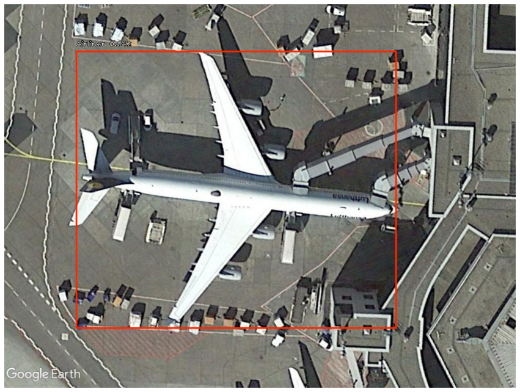

# Table of Content
[Introduction](https://github.com/shoaibsattar823/CS893-Object-Detection#object-detection)

[1. RetinaNet](url)

[2. Faster RCNN](url)

[3. YOLOv3](url)

# Object Detection
Object Detection is the problem of detecting objects in visual data. Detecing an object in image means to predict a bounding box around that object showing the coordinates in the image where the object lies and class of the object is also predicted.
In this project, I am doing object detection on [SIMS](url) using different object detection techniques/architectures which are RetinaNet, YOLOv3 and Faster RCNN.

## 1. RetinaNet
(Modified the original implementation at https://github.com/fizyr/keras-retinanet for this dataset)

###### Model Diagram

###### Training Settings
* Optimizer: Adam
* Learning Rate: 1e-5
* Epochs: 10

###### Evaluation
mAP = 0.12

###### Visualization

## 2. Faster RCNN

###### Model Diagram

